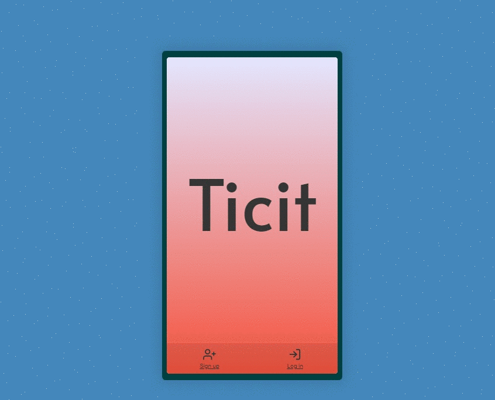

## Ticit : a platform to tag and vote all your favorite places

<a href='https://ticit-me.herokuapp.com/'>https://ticit-me.herokuapp.com/</a>

Ticit (a mix between the english "city" and the quebecois "icitte") is a platform where users can share and vote all their favorite places. It was created during Concordia Full Stack Bootcamp 2020. The idea was to create a map fed by users and not by businesses where people could share the places they love, whether it's a beautiful view, a mural or a concert venue.

## The technology

<ul>
<li>App uses the MERN stack (MongoDB, Express.js, React, Node.js). </li>
<li>Authentication and user sessions are provided by passport local strategy + bcrypt. </li>
<li>Image upload is multer + cloudinary. </li>
<li>Map plateform is Google Maps packaged by @react-google-maps/api. </li>
<li>All the UI was design by me. </li>
</ul>

## Preview

